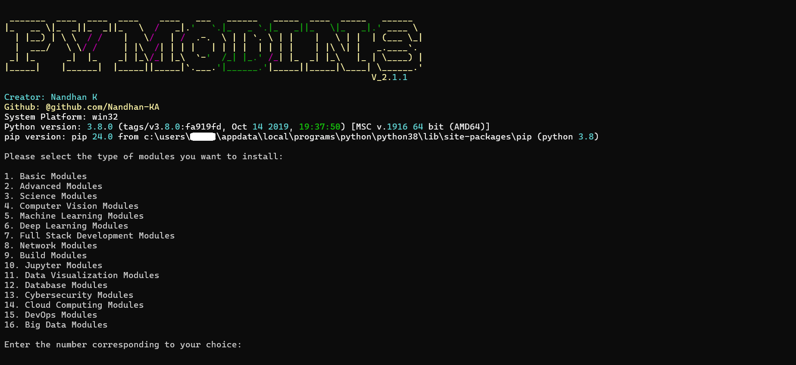

# PYMODINS

[pymodins](https://github.com/Nandhan-KA/pymodins) is more than just a tool for installing Python modules. It’s a guiding hand for newcomers, helping them navigate the complex landscape of Python development with ease. With pymodins, developers can quickly and effortlessly install modules tailored to their specific needs, whether it’s basic modules for general programming tasks or advanced modules for specialized applications..

## Installation

Use the package manager [pip](https://pip.pypa.io/en/stable/) to install pymodins.

```bash
python setup.py install 
        or
pip install pymodins
```

## Usage


Simply run ```pymodins``` in Administrator Command prompt or Admin Powershell

  or

```Python 

import pymodins

# Displays all Domains
pymodins.run()
```

# Install Basic Modules
```pymodins.install_basic_modules()```

# Install Advanced Modules

```pymodins.install_advanced_modules()```

# Install Science Modules
```pymodins.install_science_modules()```

# Install Computer Vision Modules
```pymodins.install_computervision_modules()```

# Install MachineLearning Modules()
```pymodins.install_machinelearning_modules()```

# Install Deep Learning Modules
```pymodins.install_deeplearning_modules()```

# Install Full Stack Development Modules
```pymodins.install_fullstack_modules()```

# Install Network Modules
```pymodins.install_network_modules()```

# Install Build Modules
```pymodins.install_build_modules()```

# Install Jupyter Modules
```pymodins.install_jupyter_modules()```

# Install data visualization modules
```pymodins.install_data_visualization_modules()```

# Install database modules
```pymodins.install_database_modules()```

# Install CyberSecurity modules
```pymodins.install_CyberSecurity_modules()```

# Install cloudcomputing modules
```pymodins.install_cloudcomputing_modules()```

# Install devops modules
```pymodins.install_devops_modules()```

# Install bigdata modules
```pymodins.install_bigdata_modules()```
```

## Contributing

Pull requests are welcome. For major changes, please open an issue first
to discuss what you would like to change.

Please make sure to update tests as appropriate.

## License

[MIT](https://choosealicense.com/licenses/mit/)
```
                            MIT License

                    Copyright (c) 2024 Nandhan

Permission is hereby granted, free of charge, to any person obtaining a copy
of this software and associated documentation files (the "Software"), to deal
in the Software without restriction, including without limitation the rights
to use, copy, modify, merge, publish, distribute, sublicense, and/or sell
copies of the Software, and to permit persons to whom the Software is
furnished to do so, subject to the following conditions:

The above copyright notice and this permission notice shall be included in all
copies or substantial portions of the Software.

THE SOFTWARE IS PROVIDED "AS IS", WITHOUT WARRANTY OF ANY KIND, EXPRESS OR
IMPLIED, INCLUDING BUT NOT LIMITED TO THE WARRANTIES OF MERCHANTABILITY,
FITNESS FOR A PARTICULAR PURPOSE AND NONINFRINGEMENT. IN NO EVENT SHALL THE
AUTHORS OR COPYRIGHT HOLDERS BE LIABLE FOR ANY CLAIM, DAMAGES OR OTHER
LIABILITY, WHETHER IN AN ACTION OF CONTRACT, TORT OR OTHERWISE, ARISING FROM,
OUT OF OR IN CONNECTION WITH THE SOFTWARE OR THE USE OR OTHER DEALINGS IN THE
SOFTWARE.
```

## Expected Output


# Thank you for using this project!

# Feel free to ask your queries

# Feel free to Modify