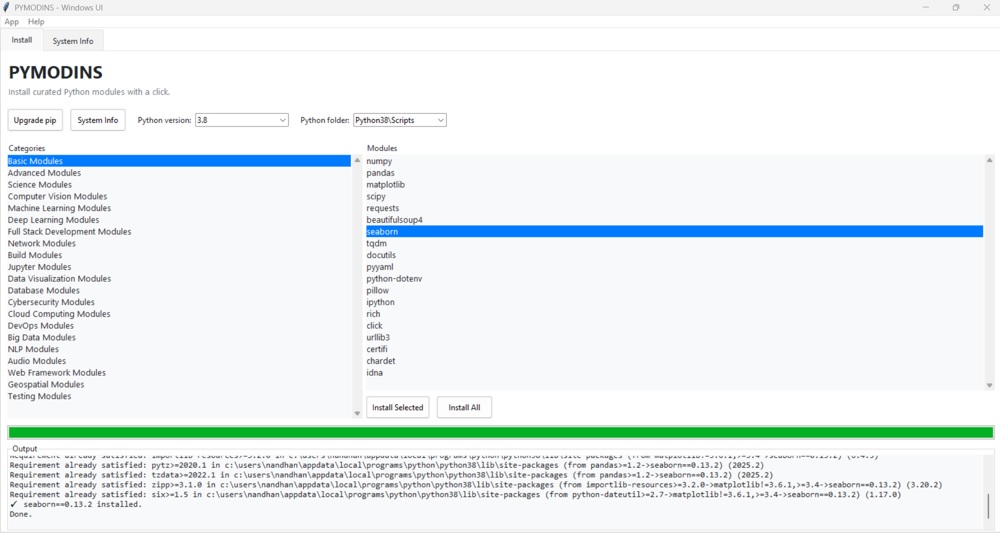

<div align="center">
  
  
  # PYMODINS
  
  ### 🐍 **Python Module Installer** - Your Gateway to Effortless Python Development
  
  [](https://choosealicense.com/licenses/mit/)
  [](https://pypi.org/project/pymodins/)
  [](https://www.python.org/)
  [](https://git-scm.com/)
  [](https://github.com/)
  [](https://www.microsoft.com/en-us/windows)
  [](https://www.linux.org/)
  [](https://pymodins.readthedocs.io/)
  [](https://pypi.org/project/pymodins/)
  [](https://github.com/Nandhan-KA/pymodins)
</div>

---

## 📖 About

**[pymodins](https://github.com/Nandhan-KA/pymodins)** is more than just a tool for installing Python modules. It's a comprehensive solution designed to simplify Python package management for developers of all skill levels. Whether you're a beginner taking your first steps in Python development or a seasoned developer managing complex projects, pymodins provides an intuitive and powerful interface to install, manage, and organize Python packages across various domains.

### 🎯 Key Highlights

- **🚀 Simplified Installation Process**: Install multiple Python packages with a single command
- **📦 Domain-Specific Packages**: Curated packages for Machine Learning, Deep Learning, Data Science, Web Development, and more
- **👶 Beginner-Friendly**: Perfect for newcomers to Python, eliminating the complexity of manual package management
- **🔄 Automated Workflows**: Automates tedious installation processes, saving time and reducing errors
- **🔧 Extensible Architecture**: Open-source and easily customizable to fit your specific needs
- **🌐 Cross-Platform**: Seamlessly works on Windows and Linux operating systems
- **🎨 Modern UI**: Beautiful graphical interface for Windows users

---

## ✨ Features

### Core Capabilities

| Feature | Description |
|---------|-------------|
| **Easy Installation** | Install multiple Python packages with a single command. No more manually typing pip install for each package. |
| **Domain-Specific Packages** | Pre-configured package collections for Machine Learning, Deep Learning, Data Visualization, Web Development, Cybersecurity, and more. |
| **Beginner Friendly** | Simplified interface that guides users through the installation process, making Python environment setup effortless. |
| **Automation** | Automates the installation of commonly used Python packages, reducing setup time from hours to minutes. |
| **Extensible** | Open to contributions and can be extended to include more modules and features as the community grows. |
| **Cross-Platform** | Works seamlessly on Windows and Linux (Ubuntu/Kali), providing a consistent experience across platforms. |

### Advanced Features

- **Graphical User Interface (GUI)**: Modern, user-friendly interface for Windows
- **Python Version Management**: Automatic compatibility detection and version-specific installations
- **Real-time Output**: Live, colorized installation progress and logs
- **Smart Package Detection**: Auto-discovers installed Python versions and pip locations
- **System Integration**: Handles special packages requiring system tools (e.g., dlib, rust)
- **System Information**: Display comprehensive system specs including CPU, RAM, disk, and network speed

---

## 🚢 What's New in 3.1

### 🎨 Enhanced Graphical User Interface
- **Modern Design**: Completely redesigned user interface with improved aesthetics and usability
- **Intuitive Navigation**: Streamlined menus and controls for better user experience
- **Visual Feedback**: Enhanced status indicators and progress tracking

### 🔧 Technical Improvements
- **Python Version Selector**: Compatibility-aware installs for Python 3.6–3.13 with automatic version pinning
- **Auto-Discovery**: Automatically detects installed Python folders and pip locations
- **Real-time Output**: Full, colorized pip output streamed directly into the UI Output panel
- **System Tools Integration**: 
  - **dlib**: Automatically prompts and invokes Visual Studio Build Tools installer
  - **rust**: Seamlessly installs via rustup

### 📊 System Information Panel
- **Hardware Details**: CPU name, core count, total/available RAM
- **Storage Information**: System disk total/free space
- **Network Performance**: Asynchronous average network speed estimation

### 📦 Expanded Package Categories
**New Categories Added:**
- NLP Modules (Natural Language Processing)
- Audio Modules
- Web Framework Modules
- Geospatial Modules
- Testing Modules

**Expanded Existing Categories:**
- Machine Learning: Additional popular ML frameworks
- Deep Learning: Extended with latest DL libraries
- Computer Vision: Comprehensive CV toolkit
- Data Visualization: More visualization options
- DevOps: Expanded automation tools
- Cloud Computing: Additional cloud services support

### 💻 CLI Enhancements
- **Pip Upgrade Helper**: Automatically checks and upgrades pip when needed
- **Installation Logging**: Tracks and logs all installed modules
- **Cross-Platform Support**: Unified entrypoints for Windows and Linux

---

## 🚀 Installation

### Method 1: Install from PyPI (Recommended)

#### For Windows
```bash
pip install pymodins
```

#### For Linux
```bash
sudo pip3 install pymodins
```

### Method 2: Install from Source

Clone the repository and install in editable mode:

```bash
git clone https://github.com/Nandhan-KA/pymodins.git
cd pymodins
pip install --editable .
```

### 📋 Requirements

- Python 3.6 or higher
- pip (Python package installer)
- Administrator/root privileges (for system-wide installation)

---

## 💻 Usage

### 🖥️ Graphical User Interface (Windows)

Launch the beautiful GUI application:

```bash
pymodins-ui
```

**Important Notes:**
- ⚠️ **Run as Administrator**: Execute in Administrator PowerShell or Command Prompt for system-wide installation
- 🐍 **Python Compatibility**: Supports Python versions 3.6–3.13 with automatic compatibility detection
- 🔍 **Auto-Discovery**: Automatically finds and lists available Python installations
- 📊 **Real-time Feedback**: Watch installation progress with colorized, real-time output
- 🛠️ **Special Packages**: Handles complex packages like dlib (VS Build Tools) and rust (rustup) automatically

### 🖥️ Command Line Interface (CLI)

#### Quick Start

Simply run `pymodins` in an Administrator Command Prompt or Admin PowerShell (same on Linux):

```bash
pymodins-ui
```

Or use it in Python with administrator privileges:

```python
import pymodins
# Displays all available domains and categories
pymodins.run()
```

### 📦 Package Installation Functions

#### Basic & Core Modules
```python
# Install Basic Modules
pymodins.install_basic_modules()

# Install Advanced Modules
pymodins.install_advanced_modules()

# Install Science Modules
pymodins.install_science_modules()
```

#### Machine Learning & AI
```python
# Install Machine Learning Modules
pymodins.install_machinelearning_modules()

# Install Deep Learning Modules
pymodins.install_deeplearning_modules()

# Install Computer Vision Modules
pymodins.install_computervision_modules()
```

#### Data & Analytics
```python
# Install Data Visualization Modules
pymodins.install_data_visualization_modules()

# Install Database Modules
pymodins.install_database_modules()

# Install Big Data Modules
pymodins.install_bigdata_modules()
```

#### Development & Infrastructure
```python
# Install Full Stack Development Modules
pymodins.install_fullstack_modules()

# Install Network Modules
pymodins.install_network_modules()

# Install Build Modules
pymodins.install_build_modules()

# Install DevOps Modules
pymodins.install_devops_modules()

# Install Cloud Computing Modules
pymodins.install_cloudcomputing_modules()
```

#### Specialized Tools
```python
# Install Jupyter Modules
pymodins.install_jupyter_modules()

# Install Cybersecurity Modules
pymodins.install_CyberSecurity_modules()
```

---

## 🎯 Expected Output

<div align="center">
  
  
  *Screenshot of the PYMODINS Graphical User Interface*
</div>

---

## 📚 Documentation

For detailed documentation, installation guides, API references, and more:

**[📖 Read the Full Documentation](https://pymodins.readthedocs.io/en/latest/)**

The documentation includes:
- Comprehensive installation guides
- Detailed API references
- Usage examples and tutorials
- Troubleshooting guides
- Contributing guidelines

---

## 🤝 Contributing

We welcome contributions from the community! Whether it's:
- 🐛 Bug reports and fixes
- ✨ New features and enhancements
- 📝 Documentation improvements
- 🎨 UI/UX improvements
- 📦 Additional package categories

### How to Contribute

1. **Fork the repository** on GitHub
2. **Create a feature branch** (`git checkout -b feature/amazing-feature`)
3. **Make your changes** and commit them (`git commit -m 'Add amazing feature'`)
4. **Push to the branch** (`git push origin feature/amazing-feature`)
5. **Open a Pull Request** with a detailed description

For major changes, please open an issue first to discuss what you would like to change.

Please make sure to update tests as appropriate and follow the existing code style.

---

## 💬 FAQ

<details>
<summary><b>1. Can this package install packages from various domains?</b></summary>

Yes! PYMODINS supports installation of packages from multiple domains including Machine Learning, Deep Learning, Data Science, Web Development, Cybersecurity, Cloud Computing, and many more. Each category is pre-configured with popular and essential packages.

</details>

<details>
<summary><b>2. Can users modify and customize this code?</b></summary>

Absolutely! PYMODINS is open-source and licensed under MIT. Users are free to modify, distribute, and use the code according to their needs. We encourage customization and contributions back to the community.

</details>

<details>
<summary><b>3. Does PYMODINS work on Linux?</b></summary>

Yes! PYMODINS is fully cross-platform and works seamlessly on:
- **Windows**: Full GUI and CLI support
- **Linux**: CLI support (Ubuntu, Kali, and other distributions)

The installation process is similar across platforms, with platform-specific optimizations where needed.

</details>

<details>
<summary><b>4. Do I need administrator/root privileges?</b></summary>

Yes, administrator (Windows) or root (Linux) privileges are recommended for system-wide installations. This ensures packages are installed properly and are accessible system-wide. For user-specific installations, you can use virtual environments.

</details>

<details>
<summary><b>5. What Python versions are supported?</b></summary>

PYMODINS supports Python 3.6 and higher, including Python 3.13. The GUI version selector automatically detects installed Python versions and ensures compatibility-aware installations.

</details>

---

## 👥 Authors

**Nandhan K**
- GitHub: [@Nandhan-KA](https://www.github.com/Nandhan-Ka)
- Email: developer.nandhank@gmail.com

---

## 📜 License

This project is licensed under the **MIT License** - see the [LICENSE](LICENSE) file for details.

```
MIT License

Copyright (c) 2025 Nandhan K

Permission is hereby granted, free of charge, to any person obtaining a copy
of this software and associated documentation files (the "Software"), to deal
in the Software without restriction, including without limitation the rights
to use, copy, modify, merge, publish, distribute, sublicense, and/or sell
copies of the Software, and to permit persons to whom the Software is
furnished to do so, subject to the following conditions:

The above copyright notice and this permission notice shall be included in all
copies or substantial portions of the Software.

THE SOFTWARE IS PROVIDED "AS IS", WITHOUT WARRANTY OF ANY KIND, EXPRESS OR
IMPLIED, INCLUDING BUT NOT LIMITED TO THE WARRANTIES OF MERCHANTABILITY,
FITNESS FOR A PARTICULAR PURPOSE AND NONINFRINGEMENT. IN NO EVENT SHALL THE
AUTHORS OR COPYRIGHT HOLDERS BE LIABLE FOR ANY CLAIM, DAMAGES OR OTHER
LIABILITY, WHETHER IN AN ACTION OF CONTRACT, TORT OR OTHERWISE, ARISING FROM,
OUT OF OR IN CONNECTION WITH THE SOFTWARE OR THE USE OR OTHER DEALINGS IN THE
SOFTWARE.
```

---

## 💬 Support

Need help? Have questions? We're here for you!

- 📧 **Email**: developer.nandhank@gmail.com
- 📖 **Documentation**: [Read the Docs](https://pymodins.readthedocs.io/en/latest/)
- 🐛 **Issues**: [GitHub Issues](https://github.com/Nandhan-KA/pymodins/issues)
- 💬 **Discussions**: [GitHub Discussions](https://github.com/Nandhan-KA/pymodins/discussions)

---

<div align="center">

### ⭐ Star us on GitHub if you find PYMODINS useful!

**Thank you for using PYMODINS!** 🎉

*Feel free to ask questions, report issues, or contribute to make PYMODINS even better!*

Made with ❤️ by [Nandhan K](https://github.com/Nandhan-KA)

</div>
