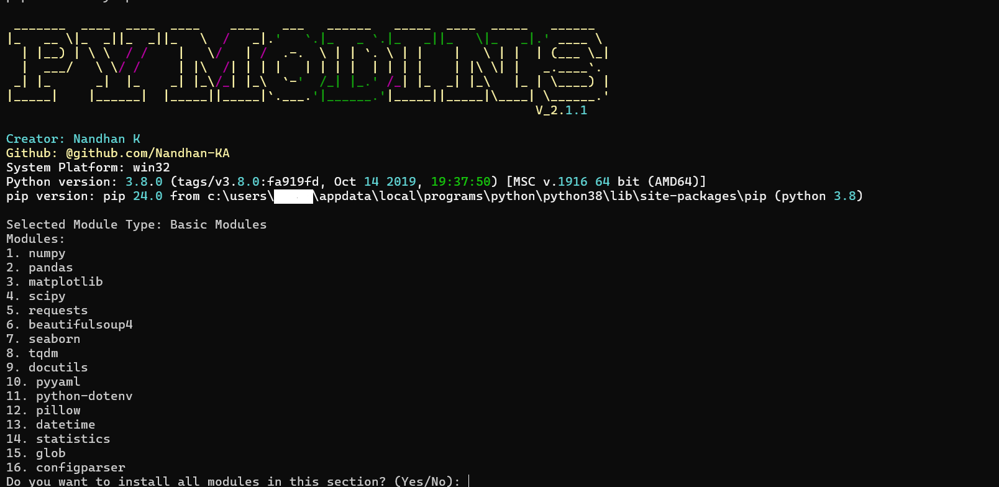

.. PyAutoGUI documentation master file, created by
   sphinx-quickstart on Sun Jul 20 12:59:43 2014.
   You can adapt this file completely to your liking, but it should at least
   contain the root `toctree` directive.

Welcome to pymodins's documentation!
=====================================

Pymodins 

To install with pip, run ``pip install pymodins``

The source code is available on: https://github.com/Nandhan-ka/pymodins

pymodins has several features:

* Easy Installation: Install multiple Python modules with a single command.
* Domain-Specific Packages: Choose from various domains like Machine Learning, Deep Learning, Data Visualization, and more.
* Beginner Friendly: Simplifies the process of setting up Python environments for beginners.
* Automation: Automates the installation of commonly used Python packages.
* Extensible: Open to contributions and can be extended to include more modules and features.

Examples
========

.. code:: python

   >>> import pymodins

   >>> pymodins.run()
.. image:: run.png

.. code:: python

   >>> pymodins.install_basic_modules()

Like wise user can able to directly install modules of many fields:

   >>> pymodins.install_advanced_modules()
   >>> pymodins.install_science_modules()
   >>> pymodins.install_computervision_modules()
   >>> pymodins.install_machinelearning_modules()
   >>> pymodins.install_deeplearning_modules()
   >>> pymodins.install_fullstack_modules()
   >>> pymodins.install_network_modules()
   >>> pymodins.install_build_modules()
   >>> pymodins.install_jupyter_modules()
   >>> pymodins.install_data_visualization_modules()
   >>> pymodins.install_database_modules()
   >>> pymodins.install_CyberSecurity_modules()
   >>> pymodins.install_cloudcomputing_modules()
   >>> pymodins.install_devops_modules()
   >>> pymodins.install_bigdata_modules()

.. toctree::
   :maxdepth: 2

This documentation is still a work in progress.

Indices and tables
==================

* :ref:`genindex`

